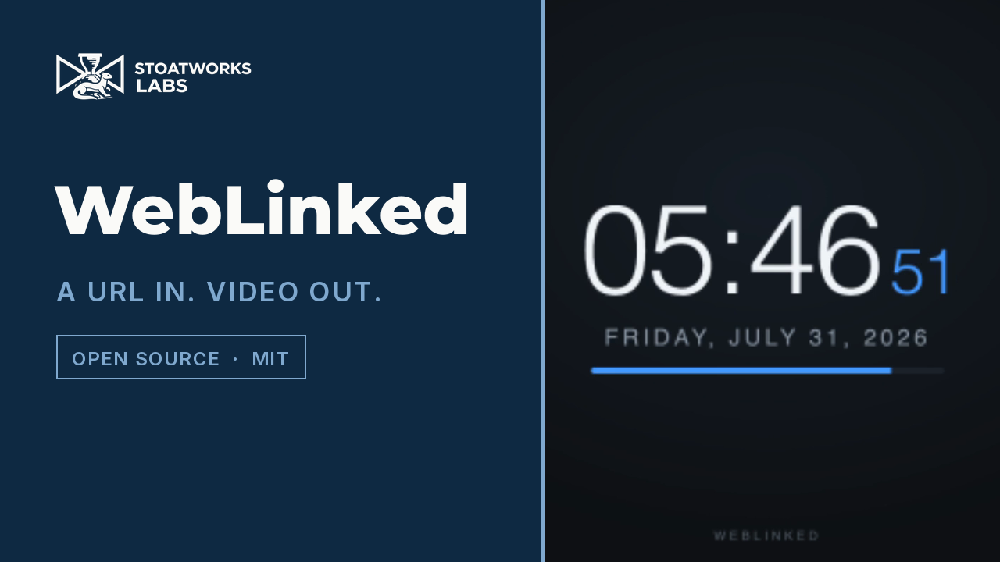
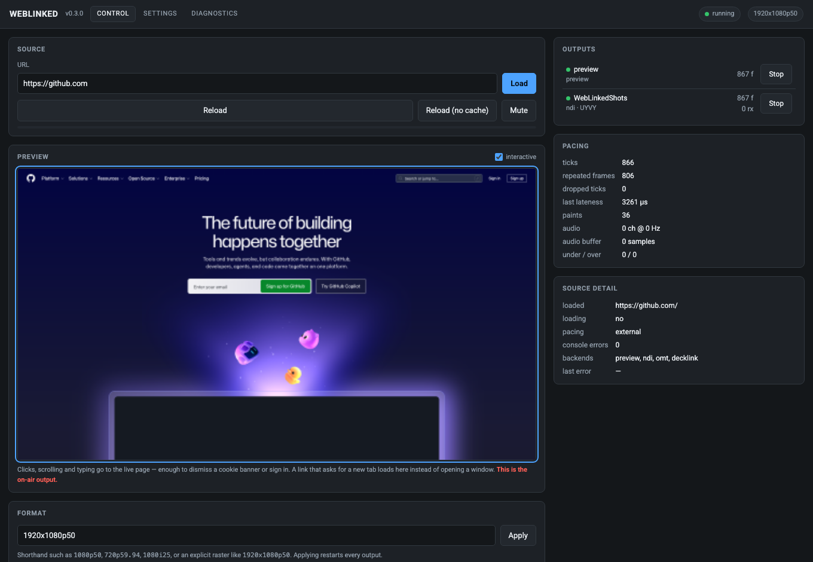
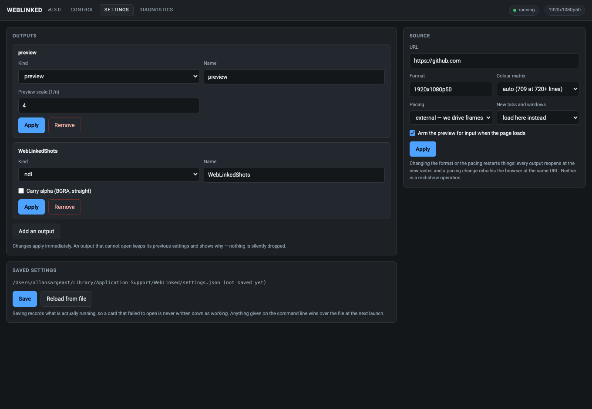
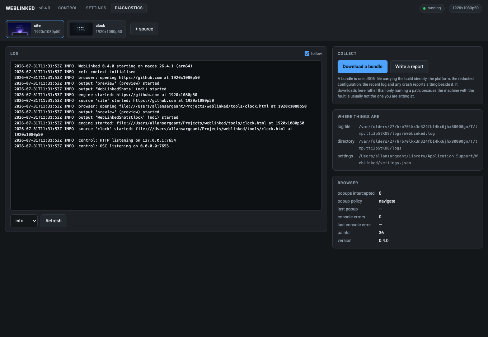
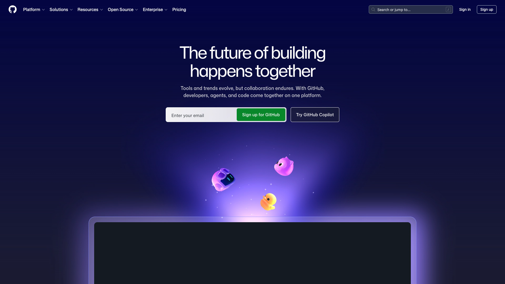
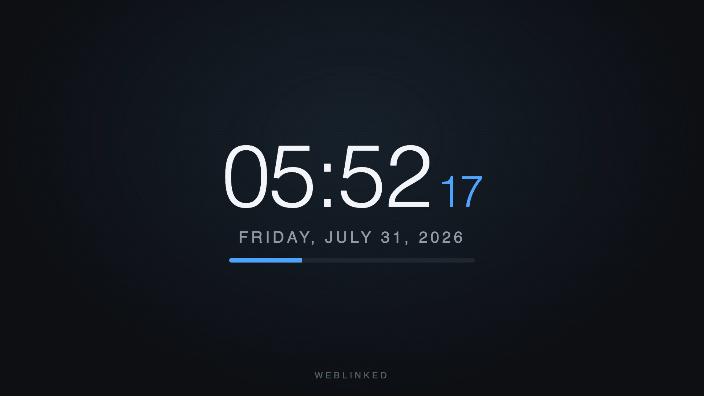

# WebLinked

> **AI-assisted project.** This codebase was created with [Claude](https://claude.com/claude-code)
> (Anthropic), directed and reviewed by a human author. NDI is verified end to
> end including alpha, DeckLink against a real Duo 2 with colour confirmed by an
> SDI loopback capture, and Syphon against Resolume Arena. **OMT and AJA have
> never been tested against a receiver or a card.** Linux has never been run, and
> on Windows only the Spout output has — through a standalone harness; the
> application itself does not yet build there.
> [Status, honestly](#status-honestly) says which is which, and
> [docs/04-verification.md](docs/04-verification.md) records exactly what was
> measured and how.

**A URL in. SDI and video-over-IP out.**

WebLinked renders a web page offscreen at a broadcast raster and frame rate, then
sends it to Blackmagic DeckLink and AJA cards over SDI, to the network as
[NDI](https://ndi.video) and [OMT](https://openmediatransport.org), and fullscreen
to a GPU-attached display. Point it at a scoreboard, a lower-third, a countdown
clock, a dashboard or a whole HTML playback page, and it becomes a source your
vision mixer can cut to — or a feed for a projector or LED processor.

Small on purpose: one binary, no service to install, no framework in the browser.
It is driven from a control page, over HTTP, or over OSC from Companion or a
show-control system.

```bash
weblinked --url https://example.com/scoreboard --format 1080p50 --ndi=Scoreboard

# A keyed graphic: alpha over NDI, and key + fill out of a DeckLink
weblinked --url https://example.com/lower-third --alpha --ndi=LowerThird --key --decklink=0

# Fullscreen on the second display, alongside SDI
weblinked --url https://example.com/wall --screen=1 --decklink=0

# An overlay for Resolume, with the page's alpha intact (macOS)
weblinked --url https://example.com/lower-third --syphon=LowerThird

# Several at once, each with its own browser, clock, raster and outputs
weblinked --config show.json
```

---

[](https://www.youtube.com/watch?v=O5Z4SFGD3bA)

*A 75-second tour of the real app, driven over its own HTTP control API. NDI is picked up
by a separate receiver (`tools/ndi_probe`), and the SDI output is a real DeckLink Duo 2 —
the panel names the sub-device it opened, and both outputs run off the same clock. See
[docs/04-verification.md](docs/04-verification.md) for what is verified and what is not.*



*The control page, driving two sources. It is the whole UI — WebLinked serves it
over HTTP and any browser on the network can reach it. The strip along the top carries a live thumbnail per
source and only appears when there is more than one, so a single-source launch
looks exactly as it always did. The preview is fed by the same frame pipeline as
the SDI and NDI outputs, so if the preview is right, the outputs are right.*

| Settings | Diagnostics |
|---|---|
| [](docs/images/settings-page.png) | [](docs/images/diagnostics-page.png) |
| Outputs, with only the fields each backend has. Saved to a file the next launch reads back. | The live log at a level you can change while the fault is happening, and a bundle that downloads. |

Both images below are **real 1920×1080 frames received over NDI** by a separate
receiver (`tools/ndi_probe`), converted back to RGB — not screenshots of a
browser. They are what a vision mixer would have seen.

| A live page | A time-of-day clock |
|---|---|
|  |  |
| source `site` | source `clock` |

Both were on the network **at the same time**, from the one process that served
the control page above — which is what the two chips in its strip are.

`tools/clock.html` ships with the repo. It is a useful thing to point at a feed:
a clock is the quickest way to see at a glance whether a signal is live, and its
sub-second progress bar makes dropped frames visible to the naked eye.

Regenerate all five with [`tools/screenshots.sh`](tools/screenshots.sh).

---

<!-- downloads:start -->

## Download

**[v0.7.1](https://github.com/stoatworks-labs/weblinked/releases/tag/v0.7.1)** — prebuilt for macOS, Windows and Linux. Pick your platform:

<details>
<summary><b>macOS</b> — Apple Silicon</summary>

| Build | Download | Size |
| --- | --- | --- |
| Apple Silicon · .dmg disk image (desktop app) | [`WebLinked.Launcher_0.7.1_aarch64.dmg`](https://github.com/stoatworks-labs/weblinked/releases/download/v0.7.1/WebLinked.Launcher_0.7.1_aarch64.dmg) | 146 MB |
| Apple Silicon · .dmg disk image (engine only) | [`weblinked-engine-0.7.1-macos-arm64.dmg`](https://github.com/stoatworks-labs/weblinked/releases/download/v0.7.1/weblinked-engine-0.7.1-macos-arm64.dmg) | 158 MB |
| Apple Silicon · .pkg installer (engine only) | [`weblinked-engine-0.7.1-macos-arm64.pkg`](https://github.com/stoatworks-labs/weblinked/releases/download/v0.7.1/weblinked-engine-0.7.1-macos-arm64.pkg) | 141 MB |

</details>

<details>
<summary><b>Windows</b> — x64</summary>

| Build | Download | Size |
| --- | --- | --- |
| x64 · .exe installer (desktop app) | [`WebLinked.Launcher_0.7.1_x64-setup.exe`](https://github.com/stoatworks-labs/weblinked/releases/download/v0.7.1/WebLinked.Launcher_0.7.1_x64-setup.exe) | 184 MB |
| x64 · .exe installer (engine only) | [`weblinked-engine-0.7.1-windows-x86_64-setup.exe`](https://github.com/stoatworks-labs/weblinked/releases/download/v0.7.1/weblinked-engine-0.7.1-windows-x86_64-setup.exe) | 134 MB |
| x64 · .zip archive (engine only) | [`weblinked-engine-0.7.1-windows-x86_64.zip`](https://github.com/stoatworks-labs/weblinked/releases/download/v0.7.1/weblinked-engine-0.7.1-windows-x86_64.zip) | 181 MB |

</details>

<details>
<summary><b>Linux</b> — x64</summary>

| Build | Download | Size |
| --- | --- | --- |
| x64 · .deb package (Debian/Ubuntu) (desktop app) | [`WebLinked.Launcher_0.7.1_amd64.deb`](https://github.com/stoatworks-labs/weblinked/releases/download/v0.7.1/WebLinked.Launcher_0.7.1_amd64.deb) | 359 MB |
| x64 · .rpm package (Fedora/RHEL) (desktop app) | [`WebLinked.Launcher-0.7.1-1.x86_64.rpm`](https://github.com/stoatworks-labs/weblinked/releases/download/v0.7.1/WebLinked.Launcher-0.7.1-1.x86_64.rpm) | 374 MB |
| x64 · .tar.gz archive (engine only) | [`weblinked-engine-0.7.1-linux-x86_64.tar.gz`](https://github.com/stoatworks-labs/weblinked/releases/download/v0.7.1/weblinked-engine-0.7.1-linux-x86_64.tar.gz) | 356 MB |

</details>

All builds, checksums and release notes: [github.com/stoatworks-labs/weblinked/releases](https://github.com/stoatworks-labs/weblinked/releases).

macOS builds are signed and notarised and open normally. The Windows builds are unsigned, so SmartScreen warns once.

<!-- downloads:end -->

## What it does

- **Renders any URL** through Chromium (CEF), offscreen, at the exact raster and
  rate you ask for — 1080p50, 720p59.94, 1080i25, 2160p30, or an arbitrary
  raster like `3840x600p60` for an LED strip.
- **Carries the page's audio** — WebAudio, `<video>`, anything Chromium plays —
  as 48 kHz float, embedded in SDI or sent alongside the IP video.
- **Outputs to six kinds of destination at once**: DeckLink, AJA, NDI, OMT, a
  fullscreen GPU display, and a Syphon source other applications on the same
  machine can pick up. Every output takes the same frame, so what NDI sees is
  what SDI sees.
- **Straight into a VJ application** (`--syphon` on macOS, `--spout` on
  Windows). The page appears as a source in Resolume Arena, VDMX,
  TouchDesigner or anything else that speaks either protocol — on the same
  machine, over shared memory, with the page's own alpha intact so an HTML
  overlay lands on a layer already keyed. Verified against Arena 7.27.1, which
  identifies it as premultiplied without being told; the Spout backend is
  verified against its own receiver, since WebLinked does not yet build on
  Windows.
- **Fullscreen on a display** (`--screen`), for a projector, a confidence monitor
  or an LED processor fed from a GPU head. Not a second browser window — it puts
  the frames the engine already produced straight onto the glass with Metal
  (Direct3D on Windows, EGL on Linux), which is why it stays consistent with the
  SDI and NDI outputs. Paced by the *display*, so a 50 Hz page on a 60 Hz monitor
  repeats frames instead of tearing, and it fits, fills or stretches to a head
  whose shape does not match the raster.
- **Frame-accurate pacing.** The engine's clock drives Chromium one frame at a
  time (`SendExternalBeginFrame`) rather than letting the browser paint on its
  own timer, so 50 ticks a second means 50 paints a second.
- **Alpha, properly**, and measured on the wire in both directions. NDI and OMT carry the page's transparency, and a DeckLink
  can output **key + fill** on separate SDI connectors (or key internally over
  its own input). Chromium composites premultiplied and every destination here
  expects straight alpha, so WebLinked un-premultiplies — without that, soft
  edges, drop shadows and fades all render too dark on a keyer.
- **A background colour, per output.** The same page can leave twice: as a key
  down an SDI keyer or an NDI feed with alpha, and composited over flat green
  for a switcher that only has a chroma keyer. The colour is chosen per output
  and toggles against transparent from the settings page, so one browser paint
  feeds both. Changing it does not restart the output.
- **An interactive preview.** The control page's preview forwards clicks,
  scrolling and typing to the live page, which is the only practical way to
  dismiss a cookie banner, close a modal or sign in on a machine whose browser
  you cannot otherwise reach. **On by default** (`--no-interactive` turns it
  off), and always outlined when armed, because it is the on-air output. A link
  that asks for a new tab loads in place rather than opening a window — a
  windowless browser cannot own one.
- **A settings page.** Add, edit, remove, start and stop outputs from the
  browser, with only the fields each backend actually has; change raster,
  colour matrix and pacing; and save the lot to a file the next launch reads
  back. Anything given on the command line still wins over the file.
- **Diagnostics in the app.** The live log with the level changeable while the
  fault is happening, a crash report on demand, and a one-file diagnostics
  bundle that **downloads** rather than naming a path on a machine you are not
  sitting at.
- **Live control**: change the URL, reload, run JavaScript in the page, change
  raster, or stop and start an output mid-show, from the control page, HTTP, or
  OSC.
- **Several sources in one process, as tabs.** Each is an independent pipeline —
  its own browser, clock, raster and outputs — and they share nothing but
  Chromium's process. A page that hangs, a card that will not open or a raster
  change on one source cannot touch the others. Add one with `+ tab` on the
  control page, or start a whole show at once with `--config show.json`. Every
  tab routes to its own outputs, so one can be going to SDI as **key + fill**
  while another goes out over NDI. The tab bar carries a live thumbnail per
  source; HTTP verbs
  take `?source=<id>` and OSC takes `/weblinked/source/<id>/<verb>`. Leave the id
  off and the request goes to the first source, so everything that drove a
  single-source WebLinked still does.

  How many a machine can carry is a property of that machine, not a setting.
  Three 1080p sources drop frames on an M4 Max; three at 720p25 do not. Measure
  it where the show will run — [docs/04-verification.md](docs/04-verification.md)
  has the numbers and the method.
- **A tray launcher** ([`launcher/`](launcher/)) for a machine where WebLinked
  should come up at login and live in the menu bar rather than in a terminal.

## What it does not do

- No compositing, no layers, no playlist. Each source renders one page. If you
  need two graphics in one picture, that is what the page is for; if you need two
  pictures, that is what a second source is for.
- No capture or input. Output only.
- No genlock. The engine's clock is a software clock; an SDI card's own scheduled
  playback absorbs the difference. See
  [docs/01-architecture.md](docs/01-architecture.md) for where that boundary sits
  and what it costs.

---

## Status, honestly

| Backend | State |
|---|---|
| **NDI** | **Verified end to end**, including alpha. A real receiver confirms raster, rate, pixel format, colour and audio. |
| **Preview** | Verified, and interactive — it is the control page's confidence monitor. |
| **Several sources** | **Verified**: three at once on three rasters, each confirmed by a separate receiver, with one retargeted and a fourth added and removed mid-run without disturbing the others. Frame rates are a capacity question — see below. |
| **Settings + diagnostics pages** | Verified against a running instance: outputs added, renamed and removed, settings saved and read back after a restart, the log and bundle served. |
| **Screen (fullscreen GPU)** | **Verified on this Mac, across two displays**: picture, all three scaling modes, live add and remove, and pacing measured against the display's own refresh — a 50 Hz source on a 60 Hz head presents at 60.1/s, a ratio of 1.199 against a theoretical 1.200. No projector, and Windows and Linux are written and never run. |
| **Tray launcher** | **Now carries WebLinked inside it**, so the macOS download is one install. The unpack, the signature surviving it and the helpers running from it are verified; the config is unit-tested for all three platforms. **The Start button itself still has not been clicked through** — see [launcher/README.md](launcher/README.md). |
| **OMT** | Compiles against `libomt.h` 1.0.0.16. **Never tested against an OMT receiver.** |
| **DeckLink** | **Verified against a real card, on two card profiles** (DeckLink Duo 2): output, pre-roll and buffer level, with colour confirmed by SDI loopback captures at 1080p50 and 1080p25 — identical sampled values in a full-duplex and a half-duplex profile. Key + fill is measured to the extent one card allows: the fill carries straight alpha. The **key channel itself**, the internal-keying composite and **audio over SDI** are still unmeasured, and a keyed 1080p50 is beyond what this card will carry. |
| **AJA** | Compiles against libajantv2 18.1. **Never run against a card.** Off by default. |
| **Shared surface (Syphon / Spout)** | **Syphon verified against Resolume Arena 7.27.1**: it lists the source, loads it on a layer at 1920x1080 and labels it premultiplied unaided. Colour, alpha and orientation are exact through a receiver linking *Arena's own* Syphon framework. **Spout is verified only through a harness** — the real backend and SDK, its pixels checked by a Spout receiver, but WebLinked itself does not build on Windows and no real Spout application was involved. |

Read [docs/04-verification.md](docs/04-verification.md) before trusting any of
this on air. It records exactly what was measured, how, and what was not.

Verified on macOS 26.4 / Apple Silicon. Windows and Linux are written for and
build-configured, but have not been built or run — the sole exception is the
Spout output, compiled and executed on Windows 11 through the harness in
`tools/`, which does not build the application around it. See
[docs/02-building.md](docs/02-building.md).

---

## Quick start

```bash
git clone https://github.com/stoatworks-labs/weblinked
cd weblinked
cmake -S . -B build -G Ninja -DCMAKE_BUILD_TYPE=Release
cmake --build build
```

CMake downloads the CEF binary distribution on first configure (~125 MB) and
caches it in `third_party/cef`. Nothing else is required to build: the NDI and
OMT backends resolve their libraries at run time, and the SDI SDKs are optional.

Then:

```bash
./build/Release/WebLinked.app/Contents/MacOS/WebLinked \
  --url https://example.com/graphic.html \
  --format 1080p50 \
  --ndi=Graphic
```

WebLinked opens no window of its own. It is a render host and a control server:
the UI is the control page it serves, which you open in a browser, drive over
HTTP or OSC, or reach from the [tray launcher](launcher/) — a menu-bar icon that
starts and stops the process and opens the page for you. That is why there is no
GUI toolkit anywhere in this project.

Started with no arguments — by a double-click, say — it hands the control page to
your default browser once the server is listening, so it does not look like
nothing happened. A command line is assumed to know what it wants and gets no
browser unless you add `--open`; `--no-open` suppresses it either way.

`--help` lists every option and reports which backends this build contains.

**Two downloads, and they are not the same thing.** The one marked *desktop app*
is the whole product: a menu-bar launcher with the engine packaged inside it, and
what you want unless you know otherwise. The ones marked *engine only* are the
render host by itself, for a machine that starts it from a command line, a
service manager or another program.

## Control

The control page is served at `http://127.0.0.1:7654/`, so a phone on the same
network is a remote panel.

```bash
curl -X POST -d '{"url":"https://example.com/next"}' http://127.0.0.1:7654/api/url
curl -X POST -d '{"ignore_cache":true}'              http://127.0.0.1:7654/api/reload
curl -X POST -d '{"name":"Graphic","enabled":false}' http://127.0.0.1:7654/api/output
# Click at the centre of the page, in normalised coordinates
curl -X POST -d '{"type":"down","nx":0.5,"ny":0.5}'  http://127.0.0.1:7654/api/input

# With several sources, ?source= picks one; without it you get the first
curl http://127.0.0.1:7654/api/sources
curl -X POST -d '{"url":"https://example.com/next"}' \
     'http://127.0.0.1:7654/api/url?source=lower-third'
```

Over OSC, on port 7655 — the shape a Companion button sends:

```
/weblinked/url          "https://example.com/next"
/weblinked/reload       1
/weblinked/output/Graphic  0
/weblinked/script       "showLowerThird('Anna Kowalski')"

# One feed by name, when several are running
/weblinked/source/lower-third/url  "https://example.com/next"
```

`/weblinked/script` is the useful one: a graphic that already exposes a function
can be driven without any integration work at all.

Full reference: [docs/03-control-api.md](docs/03-control-api.md).

**The control surface has no authentication by default** and binds to loopback.
If you bind it to a network interface, set `--token`, and understand that anyone
who can reach the port can change what is on air.

## Requirements

- **NDI**: the NDI runtime or SDK installed. Not redistributable, so WebLinked
  loads it at run time; without it the NDI output reports itself unavailable and
  everything else keeps working.
- **OMT**: `libomt` and `libvmx` beside the binary, from the
  [OMT releases](https://github.com/openmediatransport/libomtnet/releases).
  Published for Windows x64/arm64 and macOS arm64 only — there is no Linux
  binary.
- **DeckLink**: Desktop Video installed, plus the DeckLink SDK at build time
  (`-DDECKLINK_SDK_DIR=...`).
- **AJA**: [libajantv2](https://github.com/aja-video/libajantv2) 18.x at build
  time (`-DNTV2_DIR=... -DNTV2_BUILD_DIR=...`) and `-DWEBLINKED_WITH_AJA=ON`.

## Documentation

- [docs/00-overview.md](docs/00-overview.md) — what this is and who it is for
- [docs/01-architecture.md](docs/01-architecture.md) — the pipeline, and the
  decisions that shaped it
- [docs/02-building.md](docs/02-building.md) — building on each platform, and the
  macOS bundle traps
- [docs/03-control-api.md](docs/03-control-api.md) — HTTP and OSC reference
- [docs/04-verification.md](docs/04-verification.md) — what has actually been
  proven, and how to reproduce it
- [docs/diagnostics.md](docs/diagnostics.md) — logs, crash reports, bundles
- [docs/05-settings.md](docs/05-settings.md) — the settings page and the file it
  writes
- [docs/06-ndi-distribution.md](docs/06-ndi-distribution.md) — why NDI is loaded
  at run time, what the licence permits, and the attribution every project owes
- [launcher/README.md](launcher/README.md) — the menu-bar tray launcher
- [AGENTS.md](AGENTS.md) — orientation for an AI assistant or a new contributor

## Control it from Companion

[**companion-module-weblinked**](https://github.com/stoatworks-labs/companion-module-weblinked) is a [Bitfocus Companion](https://bitfocus.io/companion) connection module for this app.

Navigate, reload, **run JavaScript in the page**, mute, change format, and
enable or disable any output — plus the pacing and receiver numbers that say
whether the graphic is actually going out.

It uses the HTTP API rather than OSC, because OSC here has no feedback path: a
button could act but never light. If you only need to fire buttons, the generic
OSC module works fine — see [docs/03-control-api.md](docs/03-control-api.md).

It is not in the official Companion module store — install it via
**Settings → Developer modules path**.

<!-- attributions:start -->
This project is built on other people's work — see [ATTRIBUTIONS.md](ATTRIBUTIONS.md).
<!-- attributions:end -->

## Licence

MIT — see [LICENSE](LICENSE).

Third-party components keep their own licences. `third_party/omt/libomt.h` is MIT
(Open Media Transport contributors). The CEF binary distribution, the NDI SDK,
the DeckLink SDK and libajantv2 are each obtained separately under their own
terms; none of them are redistributed here.

**NDI® is a registered trademark of Vizrt NDI AB.** See <https://ndi.video>. The
NDI runtime is loaded at run time and is not redistributed here — see
[docs/06-ndi-distribution.md](docs/06-ndi-distribution.md) for why, and for what
the licence does and does not permit. NDI Tools are not redistributed either;
get them from <https://ndi.video/tools>.

This project is not affiliated with or endorsed by Vizrt, Blackmagic Design, or
AJA Video Systems.

---

*Review it before you trust it with a show — [Status, honestly](#status-honestly)
is the list of what has and has not been measured.*
