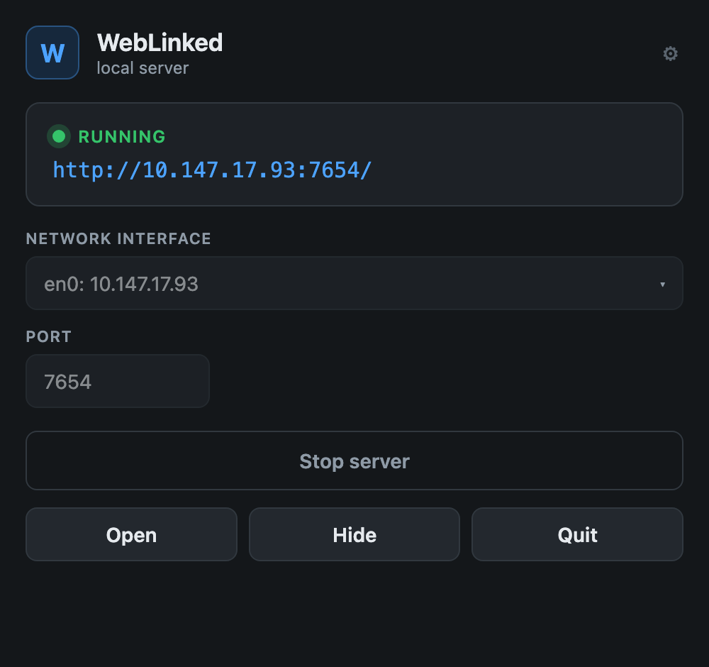
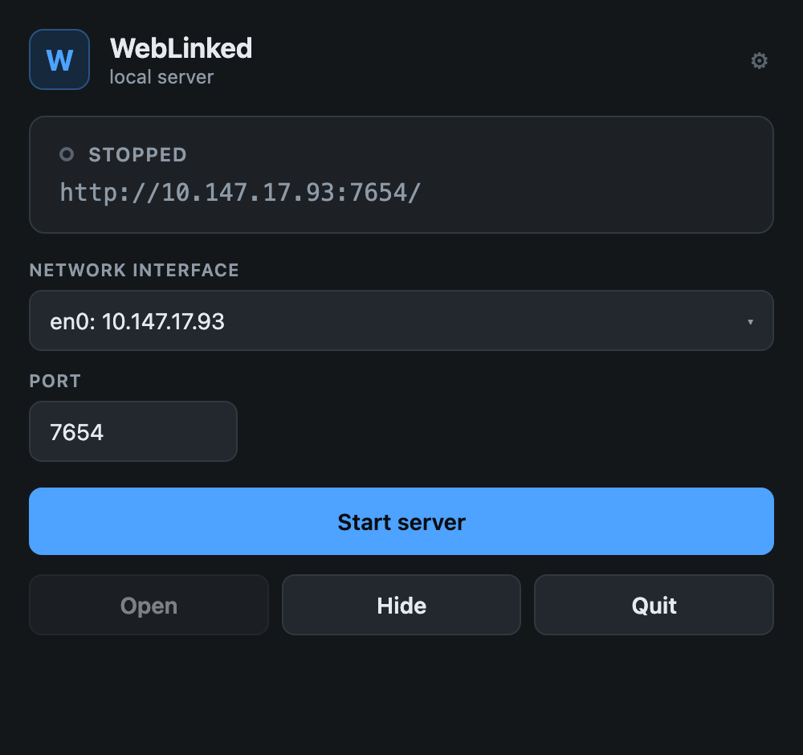

# WebLinked tray launcher

> **AI-assisted project.** This codebase was created with [Claude](https://claude.com/claude-code)
> (Anthropic), directed and reviewed by a human author. The launcher shell is
> [av-launcher](https://github.com/stoatworks-labs/av-launcher), which has been
> exercised elsewhere in this fleet. The launcher builds, its config is
> unit-tested against the file this repo ships, and the panel renders — but
> **the tray has not been clicked through against a live WebLinked**. See
> [Status](#status).

A menu-bar tray app that supervises WebLinked: pick a network interface and
port, start and stop the renderer, and open its control page — without a
terminal.

The shell is app-agnostic and comes from av-launcher; everything specific to
WebLinked is [`src-tauri/launcher.toml`](src-tauri/launcher.toml).

<table>
  <tr>
    <td align="center"><br><sub>running</sub></td>
    <td align="center"><br><sub>stopped</sub></td>
  </tr>
</table>

*Rendered from the exact panel HTML/CSS via
[`scripts/screenshot.sh`](scripts/screenshot.sh) (headless Chrome), themed from
WebLinked's own palette.*

## Why a launcher

WebLinked has no window. It is a render host and a control server, and its UI is
the control page it serves over HTTP — which is exactly right when you run it
from a terminal or a show-control system, and no help at all on a machine where
it should come up at login, sit quietly in the menu bar and be reachable from a
browser elsewhere. That is what a rack PC in a facility actually needs, and it is
what this provides: the launcher owns the lifecycle, the browser owns the view.

| | WebLinked on its own | Under the launcher |
|---|---|---|
| UI | a URL you open yourself | one click, on a chosen interface |
| bind address | `--bind`, defaults to loopback | picked from a list of interfaces |
| lifetime | as long as the terminal | tray, survives closing the browser |
| stopping | Ctrl-C | Stop, or Quit |

Both paths serve the same control page with the same settings and diagnostics.

## Running it

```bash
cd launcher
npm install
npm run tauri dev
```

Under `tauri dev` the config is read from `src-tauri/launcher.toml`, whose
`command` is relative to `src-tauri/`. Point it at your build tree first, or
target a config of your own:

```bash
AV_LAUNCHER_CONFIG=/path/to/my-weblinked.toml npm run tauri dev
```

## Building a distributable

```bash
npm run tauri build
```

The launcher **does** embed WebLinked, the way the rest of the fleet embeds its
server — but as an archive it unpacks on first run, not as a nested bundle. See
[How the embedding works](#how-the-embedding-works).

A build with no archive present — which is every `tauri dev` run — falls back to
`/Applications/WebLinked.app`, so the development flow above is unchanged.

## Status

What has been done, and what has not:

- **Verified** — the shell itself, in the other fleet apps that use it. This
  repo's `launcher.toml` is parsed by a unit test
  (`shipped_weblinked_config_produces_the_right_argv`) that asserts the exact
  argv it produces, including `--headless`; the release binary builds and comes
  up with its own log at `~/Library/Logs/WebLinked Launcher`; the panel is
  rendered above from the real HTML and CSS.
- **Verified** — that the embedded archive unpacks, keeps its signature, and
  runs with its helpers alive; a full unpack → short-circuit → upgrade cycle is
  covered by tests, as is a corrupt archive leaving no stamp behind.
- **Not verified** — Start, Stop and Launch GUI driven against a live
  WebLinked, and the built `.app` on a machine that has never seen the source.
  The Start button sits inside a WKWebView whose contents are not exposed in the
  accessibility tree, so it could not be driven from a script; the sequence it
  triggers was exercised by hand instead.

## How the embedding works

This document used to argue that WebLinked should *not* be embedded. Both of its
reasons were real. Both are addressed rather than waved away, and the workaround
it named at the end — unpacking a zipped bundle on first run — is what is
implemented.

**1. Tauri's resource collector could not walk the tree.** It follows the CEF
framework's `Versions/Current` and `Resources` symlinks and fails on a path that
does not exist (`.../Resources/Resources`). So the bundle ships as a **single
`.zip`**: one regular file, nothing to walk. CI packs it with
`ditto -c -k --sequesterRsrc --keepParent`, which is the tool that round-trips a
framework — symlinks stay symlinks, execute bits and resource forks survive.

**2. Nesting it would not have been safe.** An ad-hoc signed `.app` carrying five
name-matched helper `.app`s, inside *another* ad-hoc signed `.app`, is exactly
where Gatekeeper approves the outer bundle and SIGKILLs the inner helpers with
nothing in any log.

So it is never nested. On first run — and after an upgrade —
[`src-tauri/src/embedded.rs`](src-tauri/src/embedded.rs) expands the archive to
`~/Library/Application Support/works.stoat.weblinked.launcher/runtime/`, outside
any bundle, and `launcher.toml` points `command` at it through the `{runtime}`
placeholder. A stamp file makes every launch after the first a no-op.

What that costs: the launcher `.app` is about 142 MB instead of 3.8 MB, and the
first Start takes a few seconds to unpack. What it buys: one thing to install
instead of two, applied in the right order.

Measured, on macOS 26 — see [docs/04-verification.md](../docs/04-verification.md)
section 21:

- the ad-hoc signature survives the archive intact (`flags=0x2(adhoc)`, original
  identifier), and the extracted files carry no `com.apple.quarantine`;
- the unpacked copy runs, and its renderer and GPU helpers stay alive — the
  precise thing that dies when the nested-bundle failure mode bites;
- all of that with no re-signing. An earlier version ran
  `codesign --force --deep --sign -` over the unpacked tree; it turned out to be
  unnecessary, its own verification was failing, and `--deep` contradicts
  WebLinked's inside-out signing rule, so it was removed. The quarantine clear
  stays, because the case it defends — a `.dmg` downloaded from GitHub — cannot
  be reproduced from a source checkout.

The injection mode is `args`, so nothing about the launcher's behaviour depends
on parsing or patching a config file.

### `{runtime}` is a local addition to av-launcher

`src-tauri/src/config.rs` is vendored from av-launcher, and `{runtime}` — the
directory the supervised app actually lives in, as opposed to `{resource}`,
which is the read-only bundle — was added here. It is backwards compatible: a
config that never writes `{runtime}` behaves exactly as before. **It needs
carrying upstream** rather than being left to drift.

## Configuration

See [av-launcher's schema](https://github.com/stoatworks-labs/av-launcher/blob/main/docs/adding-an-app.md)
for the full set. WebLinked's is short, because it takes `--bind` and `--port`
directly:

```toml
[app]
name = "WebLinked"
command = "bin/WebLinked.app/Contents/MacOS/WebLinked"
args = ["--headless", "--bind", "{host}", "--port", "{port}"]
url = "http://{host}:{port}/"
default_port = 7654

[inject]
mode = "args"
```

Note what is *not* passed: `--no-settings`. The saved settings file is how an
operator's outputs survive a restart, and the launcher supplies only the bind
address and port — both of which take precedence over the file anyway.
